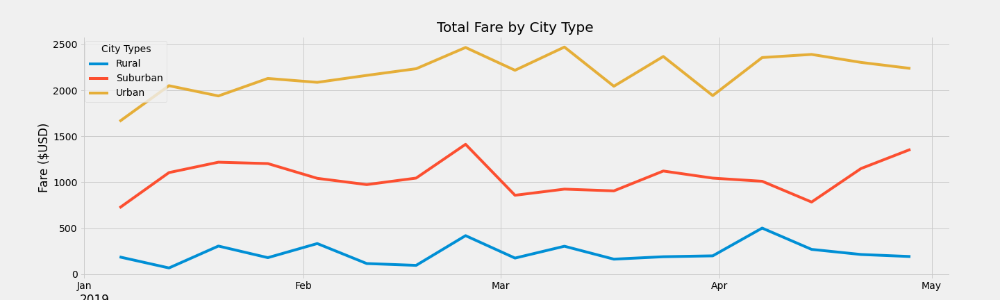

# PyBer_Analysis

## Overview of Analysis

V. Isualize has asked us to create a summary DataFrame for all Ride Sharing data by City Type. The particular summary which they would like to see is a chart which shows the total weekly fares for each City Type. Within the DataFrame which I will create will be a number of new data points such as Total Number of Rides, Total Number of Drivers and Total Number of Fares for each City Type. From this new summary data, I will calculate the average fare per ride and the average fare by driver for each type of city. This will be formatted and then presented in a chart format for easy consumption.

## Results

Summary Results by City Type:

From the above results we can see quite a few differences between each City Type. 
Urban Cities have:
1. Significantly more drivers than Rural and Suburban Cities (96% and 79% more respectively)
2. Total Rides are higher than Rural and Suburban Cities (92% and 61% more respectively)
3. Higher Total Fares than Rural and Suburban Cities (89% and 51% respectively)

Suburban Cities have:
1. 20% higher Average Fare per ride than Urban Cities
2. 58% higher Average Fare per Driver than Urban Cities

Rural Cities have:
1. Lowest amount of Rides, Drivers and Fares of all City Types
2. Highest Average Fare per Ride compared to Urban and Suburban Cities (30% and 10% respectively)
3. Highest Average Fare per Driver compared to Urban and Suburban Cities (70% and 28% respectively)

The above chart is visualizing what we have seen in the DataFrame also, that Urban Cities generate the most income by having higher total fares than Suburban and Rural Cities. We can also see there are slightly similar trends in the data around the end of Feb/start of March, where total fares increased during the week of 2/24 to then drop slightly in the following week.

## Summary
Business Recommendations:
1. Add more dedicated drivers to Urban and Suburban cities to increase revenues from short and medium distance trips.
2. Give drivers from Rural cities an opportunity to service a nearby Suburban or Urban City to help increase driver availability in these hot spots.
3. In Rural areas, riders should prebook PyBer at least 1hour in advance to ensure timely pick up and optimized use of drivers time. As these rides tend to be longer and cost more, it is likely this would not be an inconvenience to riders. Additionally, a driver could then make an informed choice to stay local in the Rural City to service prebookings or service Suburban/Urban cities instead,as suggested in the above point. 
